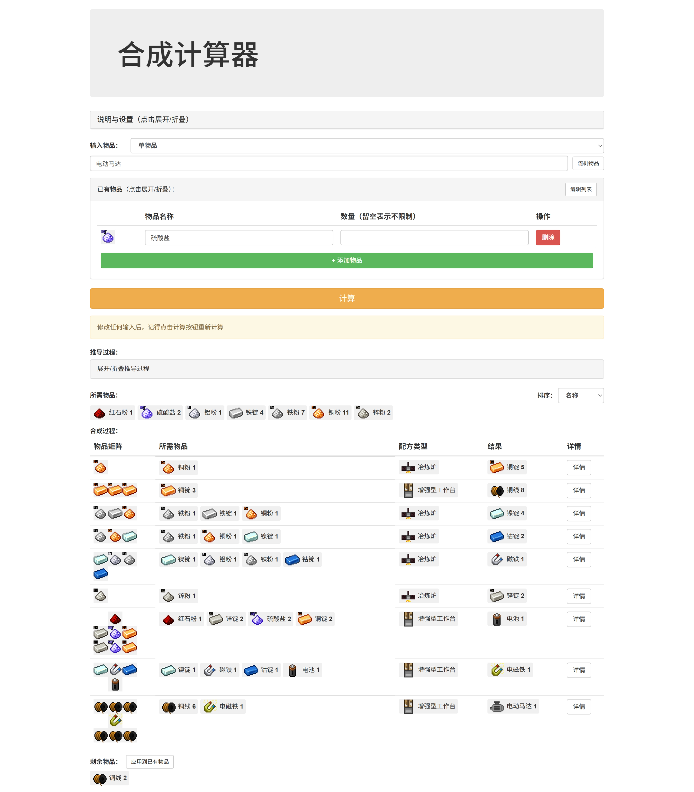

# 合成计算器

一个用于计算 Minecraft 物品合成所需原料的 Web 工具，支持配方推导和合成路径规划。

本项目虽主要针对 Slimefun 开发，但理论上可通过修改配方数据文件来适用于任何 Minecraft 原版和模组物品。

[](http://myworldzycpc.github.io/crafting-calculator/index.html)
[](LICENSE)
[](https://github.com/myworldzycpc/crafting-calculator/issues)
[](https://github.com/myworldzycpc/crafting-calculator/stargazers)

> 注意：本项目仍处于开发阶段，可能存在一些 bug 和功能缺陷。目前 Slimefun 配方和图标收录不全，欢迎提交 PR 帮助补充。

## 数据来源与致谢

本项目的核心合成配方数据，基于 [FlyCloudC/Utils-and-Games](https://github.com/FlyCloudC/Utils-and-Games) 的开源工作。

- **基础数据**：原始的配方数据文件（[table.js](https://github.com/FlyCloudC/Utils-and-Games/blob/master/utils/crafting_helper/table.js)）来源于该项目。我们对此表示诚挚的感谢。
- **数据处理**：我们对该数据文件进行了格式转换，以适配本计算器的引擎。
- **内容扩展**：在原始数据集的基础上，我们手动审核并添加了原项目中未包含的配方，扩展了计算器的覆盖范围。

## 功能特点

- 🔍 物品搜索与自动补全
- 📦 已有物品列表（支持数量限制）
- 🧪 配方推导计算
- 📊 合成路径可视化
- ⚙️ 一键添加常用粉类物品（针对 Slimefun）
- 📱 响应式设计，适配移动设备

## 截图预览



## 使用方法

1. 在输入框中输入要合成的物品名称
2. 在搜索结果中选择目标物品
3. 在"已有物品"区域添加您已有的原料
4. 点击"计算"按钮获取合成方案
5. 查看"所需物品"、"合成过程"和"剩余物品"

## 自定义配方

编辑 `recipes.js` 文件添加或修改配方：

```javascript
const recipes = {
    "物品名称": {
        type: "合成类型", // 如"工作台"
        map: [           // 合成矩阵（可选）
            ["原料1", null, "原料2"],
            [null, "原料3", null],
            ["原料4", null, "原料5"]
        ],
        ingredients: [   // 所需原料
            ["原料1", 数量],
            ["原料2"],    // 默认数量为1
            // ...
        ],
        count: 1         // 一次合成的产出数量（默认为1）
    },
    // 更多配方...
};
```

## 添加图标

1. 将图标文件放入 `icons` 目录
2. 在 `items.js` 中添加映射关系：

```javascript
const items = {
    "物品名称": {icon: "图标文件名（不含扩展名）"},
   // ...
}
```

## 安装与运行

1. 克隆仓库：
   ```bash
   git clone https://github.com/myworldzycpc/crafting-calculator.git
   ```
2. 打开 `index.html` 文件即可使用

或者，也可以直接访问 [GitHub Pages](https://myworldzycpc.github.io/crafting-calculator/index.html)

## 贡献指南

欢迎提交 Issue 和 Pull Request！贡献步骤：
1. Fork 项目
2. 提交修改
3. 创建 Pull Request

## 许可证

本项目采用 [GPLv3 许可证](LICENSE) - 详情请参阅 LICENSE 文件。

---

**提示**：图标取自 [Slimefun Resourcepack Remake (Release v1.8.0)](https://github.com/xMikux/Slimefun-Resourcepack)。

## 文件结构

```
crafting-calculator/
├── index.html
├── main.js
├── recipes.js      # 配方数据
├── items.js        # 物品数据（图标、最大堆叠数）
├── main.css        # 样式文件
├── LICENSE
├── README.md
└── icons/          # 图标目录
    ├── stone.png
    ├── iron_ore.png
    └── ...
```
